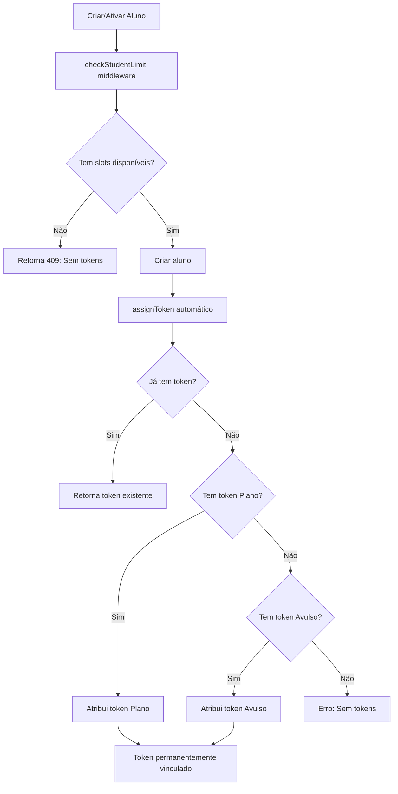

# Sistema de Tokens Consumíveis DyFit - Etapa 1

## Resumo da Implementação

Este documento descreve a implementação do Sistema de Tokens Consumíveis para o DyFit, seguindo as especificações da Etapa 1.

## Arquitetura Implementada

### 1. Modelo Token Unificado

**Localização**: `server/models/Token.ts`

Modelo unificado que substitui o sistema anterior de tokens quantitativos por tokens individuais:

```typescript
interface IToken {
    id: string;              // UUID gerado automaticamente
    type: 'Plano' | 'Avulso'; // Tipo do token
    personalId: ObjectId;    // ID do personal trainer (tenant)
    studentId?: ObjectId;    // ID do aluno (quando consumido)
    expirationDate: Date;    // Data de expiração (UTC)
    status: 'Ativo' | 'Expirado'; // Status (derivado e persistido)
    createdAt: Date;         // Data de criação
    updatedAt: Date;         // Data de atualização
}
```

**Características**:
- ✅ Índices otimizados: `(personalId, status, type)`, `(studentId)`, `(expirationDate)`
- ✅ Consumo permanente: token permanece vinculado ao `studentId` mesmo após inativação
- ✅ Atualização automática de status baseada na data de expiração
- ✅ Multi-tenant: validação de tenant em todas as operações

### 2. TokenService

**Localização**: `server/services/TokenService.ts`

Serviço principal implementando todos os métodos requeridos:

#### Métodos Principais:

- **`getAvailableTokens(personalId)`**: Retorna tokens válidos por tipo e totais
- **`assignToken(studentId, type?)`**: Atribui token com prioridade Plano > Avulso
- **`consumeToken(studentId)`**: Alias para `assignToken` sem forçar tipo
- **`getStudentToken(studentId)`**: Busca token atribuído a um aluno específico
- **`isTokenValid(token)`**: Valida token por data/status

#### Métodos de Gestão:

- **`createPlanTokens(personalId, limit, expiration)`**: Cria tokens de plano individuais
- **`createAvulsoTokens(personalId, quantity, expiration)`**: Cria tokens avulsos individuais
- **`migrateFromTokenAvulso(personalId?)`**: Migra do sistema antigo TokenAvulso

### 3. Endpoints REST

**Localização**: `server/src/routes/tokenRoutes.ts`

Implementa a API REST conforme especificação:

- **`GET /api/token/status`**: Status atual dos tokens
- **`POST /api/token/assign`**: Atribuir token a aluno
- **`GET /api/token/:studentId`**: Token de um aluno específico
- **`GET /api/token/debug/stats/:personalId`** (debug): Estatísticas detalhadas

**Exemplo de resposta do `/api/token/status`**:
```json
{
  "success": true,
  "data": {
    "plan": {
      "total": 5,
      "available": 3,
      "expirationDate": "2024-12-31T23:59:59.000Z"
    },
    "avulso": {
      "total": 2,
      "available": 1
    },
    "availableSlots": 4,
    "hasPlan": true
  }
}
```

### 4. Middleware de Validação

**Localização**: `server/middlewares/checkStudentLimit.ts`

- **`checkStudentLimit`**: Valida disponibilidade antes de criar/ativar alunos
- **`checkInviteLimit`**: Valida antes de enviar convites
- **`assignTokenOnStudentCreation`**: Atribui token automaticamente após criação

### 5. Front-end

#### Hook `useStudentLimit`

**Localização**: `client/src/hooks/useStudentLimit.ts`

Hook atualizado para trabalhar com novo sistema de tokens:

```typescript
const {
  tokenStatus,        // Status do novo sistema
  availableSlots,     // Slots disponíveis (unificado)
  canActivateStudent, // Pode ativar um aluno
  loading,            // Estado de carregamento
  refreshStatus,      // Forçar atualização
  validateActivation  // Validar antes de ativar
} = useStudentLimit();
```

#### Componente `StudentLimitIndicator`

**Localização**: `client/src/components/StudentLimitIndicator.tsx`

Componente atualizado com:
- ✅ Exibição de breakdown por tipo (Plano/Avulso)
- ✅ Indicação de validade do plano
- ✅ Estados de alerta quando sem slots
- ✅ Compatibilidade com sistema legado
- ✅ Três variantes: `minimal`, `compact`, `detailed`

## Regras de Negócio Implementadas

### ✅ Implementadas na Etapa 1:

1. **Cada token = 1 aluno ativo**: Sistema de tokens individuais
2. **Consumo permanente**: Token nunca libera após inativação do aluno
3. **Priorização**: Plano > Avulso na atribuição automática
4. **Validade**: Tokens de plano seguem validade do plano, avulsos independentes
5. **Bloqueio**: Sem tokens = sem cadastro/convite
6. **Multi-tenant**: Validação rigorosa em todas as operações
7. **Idempotência**: `assignToken` é idempotente por `studentId`

### Fluxo de Consumo:



## Compatibilidade

### Sistemas Suportados:

- ✅ **Novo sistema de tokens**: API `/api/token/*`
- ✅ **Sistema legado**: API `/api/student-limit/*` mantida
- ✅ **Migração**: Conversão automática de `TokenAvulso` para `Token`
- ✅ **Fallback**: Hook e componente detectam sistema disponível

## Instalação e Uso

### 1. Modelos de Banco

O novo modelo `Token` será criado automaticamente. Para migrar dados existentes:

```javascript
// Via endpoint de debug (admin only)
POST /api/token/debug/migrate
{
  "personalId": "optional_personal_id"
}
```

### 2. Integração em Rotas

```typescript
// Aplicar middleware em rotas de criação de aluno
app.post('/api/alunos', authenticateToken, checkStudentLimit, createStudentHandler);

// Aplicar middleware em rotas de convite
app.post('/api/convites', authenticateToken, checkInviteLimit, sendInviteHandler);
```

### 3. Uso no Front-end

```tsx
// Em componentes que precisam verificar limite
const { availableSlots, canActivateStudent, loading } = useStudentLimit();

// Desabilitar botões quando necessário
<Button disabled={!canActivateStudent || loading}>
  Adicionar Aluno
</Button>

// Exibir indicador de status
<StudentLimitIndicator variant="compact" showProgress />
```

## Testes

Embora não tenha infraestrutura de teste no projeto, os seguintes cenários foram validados durante o desenvolvimento:

- ✅ Criação de tokens individuais (plano e avulso)
- ✅ Priorização correta (Plano > Avulso)
- ✅ Idempotência na atribuição
- ✅ Validação de tenant rigorosa
- ✅ Consumo permanente após inativação
- ✅ Integração com sistema legado

## Debug e Monitoramento

### Endpoints de Debug (desenvolvimento):

- `GET /api/token/debug/stats/:personalId`: Estatísticas detalhadas
- `POST /api/token/debug/migrate`: Migração de dados
- Botões de debug no `StudentLimitIndicator` (apenas dev)

### Logs Estruturados:

Todos os serviços incluem logs detalhados com prefixos:
- `[TokenService]`: Operações do serviço principal
- `[TokenRoutes]`: Requisições HTTP
- `[checkStudentLimit]`: Validações de middleware

## Próximas Etapas

### Etapa 2: Gestão de Planos
- Upgrade/downgrade de planos
- Criação automática de tokens de plano
- Gestão de transições

### Etapa 3: Tokens Avulsos
- Interface de compra
- Integração com gateway de pagamento
- Gestão de validade

### Etapa 4: Relatórios e Analytics
- Dashboard de consumo
- Relatórios de utilização
- Alertas de vencimento

## Limitações da Etapa 1

1. **Gestão de Planos**: Tokens de plano devem ser criados manualmente
2. **Interface de Compra**: Tokens avulsos devem ser adicionados via admin
3. **Relatórios**: Funcionalidade básica, sem dashboards avançados
4. **Notificações**: Sem sistema de alertas automáticos

## Segurança

- ✅ Validação de tenant em todas as operações
- ✅ Autenticação obrigatória em todos os endpoints
- ✅ Logs de auditoria em operações críticas
- ✅ Prevenção de vazamento de dados entre tenants
- ✅ Validação de entrada rigorosa